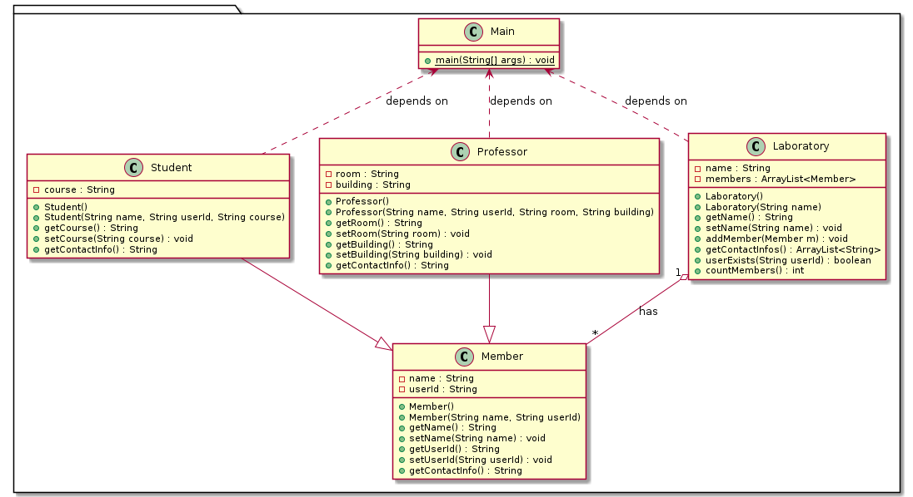

<!--
author:   Andrea Charão

email:    andrea@inf.ufsm.br

version:  0.0.1

language: PT-BR

narrator: Brazilian Portuguese Female

comment:  Material de apoio para a disciplina
          ELC117 - Paradigmas de Programação
          da Universidade Federal de Santa Maria

translation: English  translations/English.md

link:     https://cdn.jsdelivr.net/chartist.js/latest/chartist.min.css

script:   https://cdn.jsdelivr.net/chartist.js/latest/chartist.min.js


onload
window.CodeRunner = {
    ws: undefined,
    handler: {},

    init(url) {
        this.ws = new WebSocket(url);
        const self = this
        this.ws.onopen = function () {
            self.log("connections established");
            setInterval(function() {
                self.ws.send("ping")
            }, 15000);
        }
        this.ws.onmessage = function (e) {
            // e.data contains received string.

            let data
            try {
                data = JSON.parse(e.data)
            } catch (e) {
                self.warn("received message could not be handled =>", e.data)
            }
            if (data) {
                self.handler[data.uid](data)
            }
        }
        this.ws.onclose = function () {
            self.warn("connection closed")
        }
        this.ws.onerror = function (e) {
            self.warn("an error has occurred => ", e)
        }
    },
    log(...args) {
        console.log("CodeRunner:", ...args)
    },
    warn(...args) {
        console.warn("CodeRunner:", ...args)
    },
    handle(uid, callback) {
        this.handler[uid] = callback
    },
    send(uid, message) {
        message.uid = uid
        this.ws.send(JSON.stringify(message))
    }
}

//window.CodeRunner.init("wss://coderunner.informatik.tu-freiberg.de/")
window.CodeRunner.init("wss://ancient-hollows-41316.herokuapp.com/")

//window.CodeRunner.init("ws://127.0.0.1:8000/")

@end


@LIA.c:       @LIA.eval(`["main.c"]`, `gcc -Wall main.c -o a.out`, `./a.out`)
@LIA.clojure: @LIA.eval(`["main.clj"]`, `none`, `clojure -M main.clj`)
@LIA.cpp:     @LIA.eval(`["main.cpp"]`, `g++ main.cpp -o a.out`, `./a.out`)
@LIA.go:      @LIA.eval(`["main.go"]`, `go build main.go`, `./main`)
@LIA.haskell: @LIA.eval(`["main.hs"]`, `ghc main.hs -o main`, `./main`)
@LIA.java:    @LIA.eval(`["@0.java"]`, `javac @0.java`, `java @0`)
@LIA.julia:   @LIA.eval(`["main.jl"]`, `none`, `julia main.jl`)
@LIA.mono:    @LIA.eval(`["main.cs"]`, `mcs main.cs`, `mono main.exe`)
@LIA.nasm:    @LIA.eval(`["main.asm"]`, `nasm -felf64 main.asm && ld main.o`, `./a.out`)
@LIA.python:  @LIA.python3
@LIA.python2: @LIA.eval(`["main.py"]`, `python2.7 -m compileall .`, `python2.7 main.pyc`)
@LIA.python3: @LIA.eval(`["main.py"]`, `none`, `python3 main.py`)
@LIA.r:       @LIA.eval(`["main.R"]`, `none`, `Rscript main.R`)
@LIA.rust:    @LIA.eval(`["main.rs"]`, `rustc main.rs`, `./main`)
@LIA.zig:     @LIA.eval(`["main.zig"]`, `zig build-exe ./main.zig -O ReleaseSmall`, `./main`)

@LIA.dotnet:  @LIA.dotnet_(@uid)

@LIA.dotnet_
<script>
var uid = "@0"
var files = []

files.push(["project.csproj", `<Project Sdk="Microsoft.NET.Sdk">
  <PropertyGroup>
    <OutputType>Exe</OutputType>
    <TargetFramework>net6.0</TargetFramework>
    <ImplicitUsings>enable</ImplicitUsings>
    <Nullable>enable</Nullable>
  </PropertyGroup>
</Project>`])

files.push(["Program.cs", `@input(0)`])

send.handle("input", (e) => {
    CodeRunner.send(uid, {stdin: e})
})
send.handle("stop",  (e) => {
    CodeRunner.send(uid, {stop: true})
});


CodeRunner.handle(uid, function (msg) {
    switch (msg.service) {
        case 'data': {
            if (msg.ok) {
                CodeRunner.send(uid, {compile: "dotnet build -nologo"})
            }
            else {
                send.lia("LIA: stop")
            }
            break;
        }
        case 'compile': {
            if (msg.ok) {
                if (msg.message) {
                    if (msg.problems.length)
                        console.warn(msg.message);
                    else
                        console.log(msg.message);
                }

                send.lia("LIA: terminal")
                console.clear()
                CodeRunner.send(uid, {exec: "dotnet run"})
            } else {
                send.lia(msg.message, msg.problems, false)
                send.lia("LIA: stop")
            }
            break;
        }
        case 'stdout': {
            if (msg.ok)
                console.stream(msg.data)
            else
                console.error(msg.data);
            break;
        }

        case 'stop': {
            if (msg.error) {
                console.error(msg.error);
            }

            if (msg.images) {
                for(let i = 0; i < msg.images.length; i++) {
                    console.html("<hr/>", msg.images[i].file)
                    console.html("")
                }

            }

            send.lia("LIA: stop")
            break;
        }

        default:
            console.log(msg)
            break;
    }
})


CodeRunner.send(
    uid, { "data": files }
);

"LIA: wait"
</script>
@end

@LIA.eval:  @LIA.eval_(false,@uid,`@0`,@1,@2)

@LIA.evalWithDebug: @LIA.eval_(true,@uid,`@0`,@1,@2)

@LIA.eval_
<script>
const uid = "@1"
var order = @2
var files = []

if (order[0])
  files.push([order[0], `@'input(0)`])
if (order[1])
  files.push([order[1], `@'input(1)`])
if (order[2])
  files.push([order[2], `@'input(2)`])
if (order[3])
  files.push([order[3], `@'input(3)`])
if (order[4])
  files.push([order[4], `@'input(4)`])
if (order[5])
  files.push([order[5], `@'input(5)`])
if (order[6])
  files.push([order[6], `@'input(6)`])
if (order[7])
  files.push([order[7], `@'input(7)`])
if (order[8])
  files.push([order[8], `@'input(8)`])
if (order[9])
  files.push([order[9], `@'input(9)`])


send.handle("input", (e) => {
    CodeRunner.send(uid, {stdin: e})
})
send.handle("stop",  (e) => {
    CodeRunner.send(uid, {stop: true})
});


CodeRunner.handle(uid, function (msg) {
    switch (msg.service) {
        case 'data': {
            if (msg.ok) {
                CodeRunner.send(uid, {compile: @3})
            }
            else {
                send.lia("LIA: stop")
            }
            break;
        }
        case 'compile': {
            if (msg.ok) {
                if (msg.message) {
                    if (msg.problems.length)
                        console.warn(msg.message);
                    else
                        console.log(msg.message);
                }

                send.lia("LIA: terminal")
                CodeRunner.send(uid, {exec: @4})

                if(!@0) {
                  console.clear()
                }
            } else {
                send.lia(msg.message, msg.problems, false)
                send.lia("LIA: stop")
            }
            break;
        }
        case 'stdout': {
            if (msg.ok)
                console.stream(msg.data)
            else
                console.error(msg.data);
            break;
        }

        case 'stop': {
            if (msg.error) {
                console.error(msg.error);
            }

            if (msg.images) {
                for(let i = 0; i < msg.images.length; i++) {
                    console.html("<hr/>", msg.images[i].file)
                    console.html("")
                }

            }

            send.lia("LIA: stop")
            break;
        }

        default:
            console.log(msg)
            break;
    }
})


CodeRunner.send(
    uid, { "data": files }
);

"LIA: wait"
</script>
@end

-->

<!--
nvm use v14.21.1
liascript-devserver --input README.md --port 3001 --live
https://liascript.github.io/course/?https://raw.githubusercontent.com/AndreaInfUFSM/elc117-2023b/master/classes/19/README.md
-->


# Programação Orientada a Objetos


> Este material faz parte de uma introdução ao paradigma de **programação orientada a objetos** em linguagem Java.


## Conceitos da POO

A programação orientada a objetos se baseia em alguns conceitos (independentes de sintaxe) que favorecem organização, manutenção, compreensão e reuso de código. 

Conceitos básicos:

- [ ] Encapsulamento: https://en.wikipedia.org/wiki/Encapsulation_%28computer_programming%29

- [ ] Herança: https://en.wikipedia.org/wiki/Inheritance_%28object-oriented_programming%29

- [ ] Polimorfismo: https://en.wikipedia.org/wiki/Polymorphism_%28(computer_science%29


## Diagramas de classe (UML)


- Programas orientados a objetos são organizados em muitas classes que **se relacionam** umas com as outras
- Interseção com engenharia de software: modelagem de software com UML (Unified Modeling Language)

  - na Wikipedia: https://en.wikipedia.org/wiki/Unified_Modeling_Language
  - esoecificação oficial: https://www.omg.org/spec/UML/

- Diagramas de classe descrevem a estrutura de um software graficamente

  - classes representadas por retângulos compartimentados, separando nome da classe, atributos, métodos
  - relações entre classes representadas por linhas/flechas interligando as classes
  - na Wikipedia: https://en.wikipedia.org/wiki/Class_diagram


![Diagrama de classes referente à última prática, com retângulos representando 4 classes: Student, Professor, Laboratory e Main. Cada retângulo tem linhas divisórias horizontais que os compartimentam em 3 sub-retângulos, da seguinte forma: no compartimento (sub-retângulo) superior temos o nome da classe; no meio, temos uma lista com os atributos da classe, um por linha; no compartimento inferior temos uma lista com os métodos da classe. À esquerrda de cada atributo/método, há símbolos indicando sua visibilidade (lembre do encapsulamento). O diagrama também tem linhas interligando pares de classes que se relacionam, sendo que o tipo de linha e suas extremidades indicam o tipo de relação. ](img/uml-class-diagram.png)

### Relações entre classes

- Podem ser: associação, herança, realização/implementação, dependência, agregação, composição
- Associação: atributo de uma classe referencia uma instância (ou instâncias) de outra classe
- Agregação: tipo de associação entre "um todo" e uma parte, que pode existir independentemente
- Dependência: uma classe usa objeto de outra classe, mudanças na segunda podem afetar a primeira


Mais sobre isso em: 

- Visual Paradigm: uma ferramenta clássica de modelagem de software
- https://blog.visual-paradigm.com/what-are-the-six-types-of-relationships-in-uml-class-diagrams/#Association_Relationships


## Herança

- Outro tipo de relação entre classes 
- Inspirada no "mundo real": pais transmitem aos filhos suas características e comportamento
- Motivação: evitar **redundâncias** - mais produtividade, mais facilidade de manutenção
- Menos frequente que associação/agregação/dependência (programas "pequenos" nem sempre necessitam de herança)


### Exemplo: Student, Professor, Laboratory

Problema:

- Classes Student e Professor têm alguns atributos idênticos (redundância): name, userId
- Classe Laboratory tem métodos com código redundante (mesmo algoritmo aplicado a Student,  Professor, ...)

Solução: 

- Criar uma classe Person com atributos/métodos comuns a Student e Professor
- Criar Student e Professor como classes derivadas (que herdam atributos/métodos) de Person 


### Em Java: `extends`

Nova classe `Person` (super-classe, classe mãe):

- é uma classe como outra qualquer que vimos até agora

``` java
class Person {
  private String name;
  public Person() {
    this.name = "to be given";
  }
  public String getName() {
    return this.name;
  }
}
```


Classe `Student` derivada de `Person`:

- usa `extends` em sua definição para indicar que herda atributos/métodos de outra classe
- outras linguagens de OOP suportam o mesmo conceito mas variam a sintaxe e particularidades

``` java
class Student extends Person {
  private String course;
  public Student() {
    this.course = "to be chosen";
  }
}
```

### Em UML

Diagrama de uma solução para a prática da aula passada (*):



(*) No diagrama, a classe Member equivale à classe que chamamos de Person aqui nos códigos em Java.

### No Repl.it

Código sem/com herança (*):

https://replit.com/@AndreaSchwertne/java-inheritance

(*) No Repl.it, a classe Member equivale à classe que chamamos de Person aqui nos códigos em Java.

### Herança implica em...

> Fim do copy/paste de código entre classes! :-)

- objeto da classe `Student` terá atributos `name` (herdado de `Person`) e `course` 
- objeto da classe `Student` terá método `getName()`(herdado de `Person`)
- fica implícito que classes usuárias de `Student` podem chamar `getName()`


``` java
class Person {
  private String name;
  public Person() {
    this.name = "to be given";
  }
  public String getName() {
    return this.name;
  }
}


class Student extends Person {
  private String course;
  public Student() {
    this.course = "to be chosen";
  }
}


class Main {
 public static void main(String[] args) {
   Person p = new Person();
   Student s = new Student();
   System.out.println(p.getName());
   System.out.println(s.getName()); // herança em ação!
 }
}
```

### Construtores 

> Construtor de classe-mãe é chamado implicitamente **ANTES** do construtor da filha!


``` java
class Person {
  private String name;
  public Person() {
    System.out.println("Construtor de Person");
  }
  public String getName() {
    return this.name;
  }
}

class Student extends Person {
  private String course;
  public Student() {
    System.out.println("Construtor de Student");
  }
}

class Main {
  public static void main(String[] args) {
    // chama construtor de Person e depois de Student
    Student s = new Student();
  }
}
```

### Encapsulamento

> Atributos e métodos **privados** da classe-mãe **não podem** ser acessados na classe-filha

``` java
class Student extends Person {
  private String course;
  public Student() {
    System.out.println("Construtor de Student");
    this.course = "CC";
    this.name = ""; // erro: name is private
  }
}
```

### Visibilidade `protected`

> Torna atributos e métodos visíveis a classes derivadas (mas não a outras classes "fora da família")

``` java
class Person {
  protected String name; // agora é protected!
  public Person() {
    System.out.println("Construtor de Person");
  }
  public String getName() {
    return this.name;
  }
}

class Student extends Person {
  private String course;
  public Student() {
    System.out.println("Construtor de Student");
    this.course = "CC";
    this.name = ""; // OK agora!
  }
}
```

### Herança: relação "is-a"

Herança também implica em: 

- Student "is-a" Person (todo estudante é uma pessoa)
- Logo, objeto Student pode ser usado onde se espera Person
- Contrário não se aplica: nem toda pessoa é estudante

``` java
class Main {
  public static void main(String[] args) {
    Person p = new Person();
    Student s = new Student();
    ArrayList<Person> lis = new ArrayList<Person>();
    lis.add(p);
    lis.add(s);
  }
}
```

### "is-a" X "has-a"

Lembre-se que classes podem se relacionar de diferentes maneiras

| "is-a" (é-um)   | "has-a" (tem-um)   |
| :--------- | :--------- |
| herança (generalização/especialização)     | agregação/composição     |
| `class Student extends Person { }` | `class Person { String name; }` | 
| Student is a Person | Person has a String (name) | 


## Quando usar herança?

- Lembre alguns objetivos da OOP: código organizado, mais fácil de ler e modificar
- Herança evita redundâncias: código repetitivo com algumas substituições
- Muitas bibliotecas/frameworks costumam exigir que você crie suas classes derivadas de outras existentes
- Quando estiver criando sua hierarquia de classes, aplique o teste "is-a"


Faça o teste:

  - [[x]] class Piano extends Instrumento
  - [[ ]] class Lista extends Elemento
  - [[ ]] class Pessoa extends Administrador
  - [[x]] class Cerveja extends Bebida
  - [[ ]] class Ferrari extends Motor
  - [[ ]] class Bebida extends Vinho
  - [[x]] class Prata extends Metal
  - [[ ]] class Button extends Window
  - [[x]] class Felino extends Animal
  - [[ ]] class Vehicle extends Bus


## Herança no "mundo real"!

- Hierarquia de classes do pacote `javax.swing` para criação de interfaces gráficas para desktop: https://docs.oracle.com/en/java/javase/21/docs/api/java.desktop/javax/swing/package-tree.html
- Hierarquia de classes do framework Spring Boot para aplicações web (backend): https://docs.spring.io/spring-boot/docs/current/api/overview-tree.html

O que há em comum?

> Em Java, todas as classes derivam implicitamente da classe `Object` !


## Bibliografia


Robert Sebesta. Conceitos de Linguagens de Programação. Bookman, 2018. Disponível no Portal de E-books da UFSM: http://portal.ufsm.br/biblioteca/leitor/minhaBiblioteca.html (Capítulos 11 e 12)
