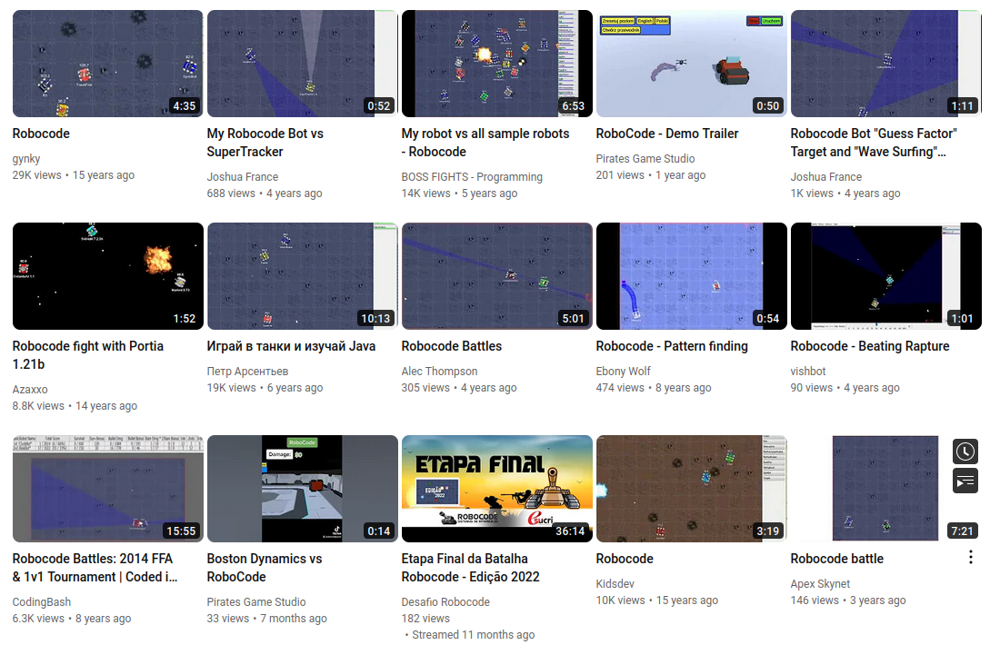
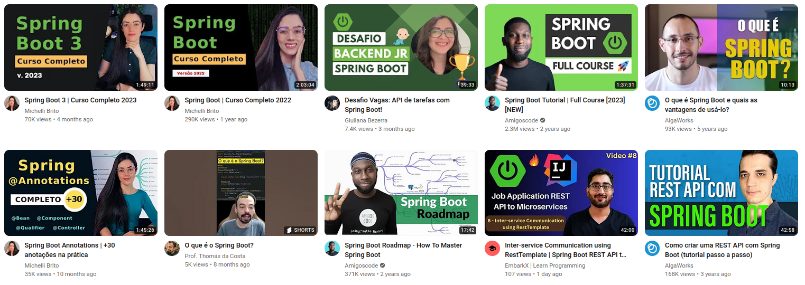
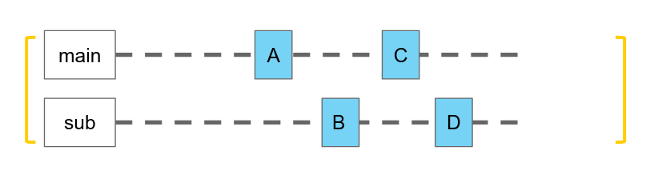
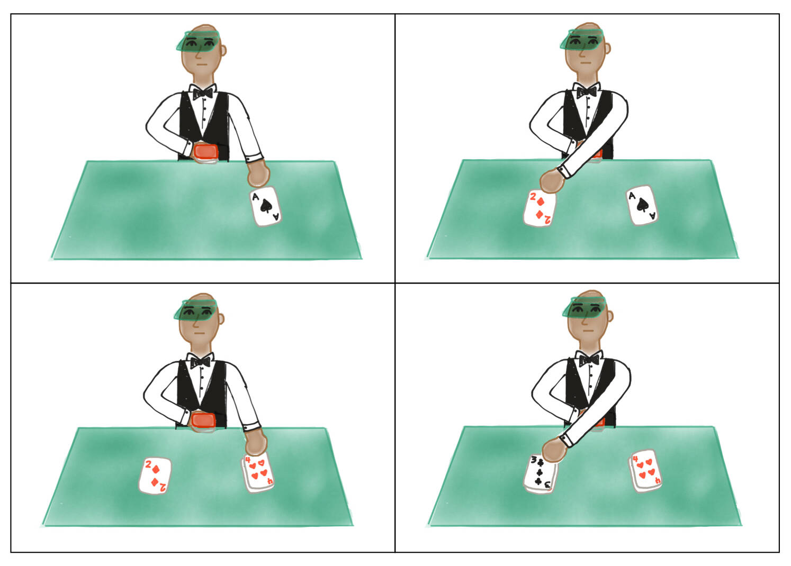
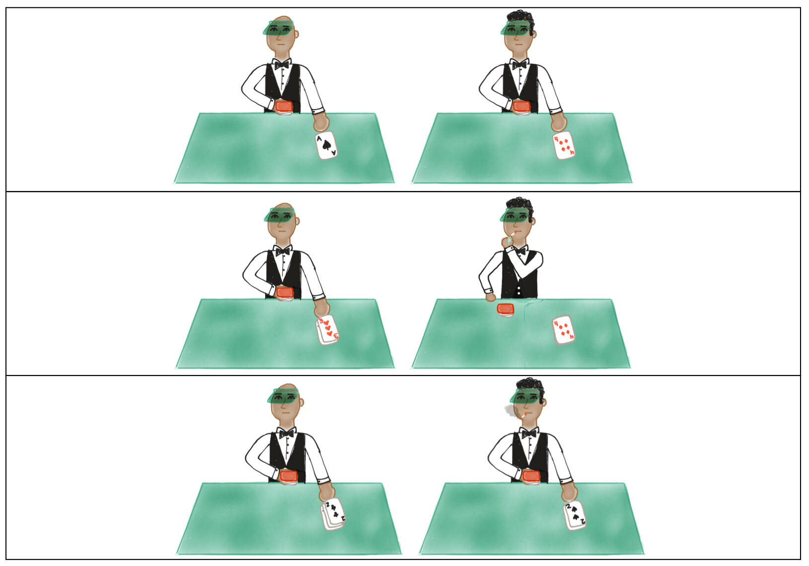

<!--
author:   Andrea Charão

email:    andrea@inf.ufsm.br

version:  0.0.1

language: PT-BR

narrator: Brazilian Portuguese Female

comment:  Material de apoio para a disciplina
          ELC117 - Paradigmas de Programação
          da Universidade Federal de Santa Maria

translation: English  translations/English.md

link:     https://cdn.jsdelivr.net/chartist.js/latest/chartist.min.css

script:   https://cdn.jsdelivr.net/chartist.js/latest/chartist.min.js


onload
window.CodeRunner = {
    ws: undefined,
    handler: {},

    init(url) {
        this.ws = new WebSocket(url);
        const self = this
        this.ws.onopen = function () {
            self.log("connections established");
            setInterval(function() {
                self.ws.send("ping")
            }, 15000);
        }
        this.ws.onmessage = function (e) {
            // e.data contains received string.

            let data
            try {
                data = JSON.parse(e.data)
            } catch (e) {
                self.warn("received message could not be handled =>", e.data)
            }
            if (data) {
                self.handler[data.uid](data)
            }
        }
        this.ws.onclose = function () {
            self.warn("connection closed")
        }
        this.ws.onerror = function (e) {
            self.warn("an error has occurred => ", e)
        }
    },
    log(...args) {
        console.log("CodeRunner:", ...args)
    },
    warn(...args) {
        console.warn("CodeRunner:", ...args)
    },
    handle(uid, callback) {
        this.handler[uid] = callback
    },
    send(uid, message) {
        message.uid = uid
        this.ws.send(JSON.stringify(message))
    }
}

//window.CodeRunner.init("wss://coderunner.informatik.tu-freiberg.de/")
//window.CodeRunner.init("wss://ancient-hollows-41316.herokuapp.com/")

//window.CodeRunner.init("ws://127.0.0.1:8000/")

@end


@LIA.c:       @LIA.eval(`["main.c"]`, `gcc -Wall main.c -o a.out`, `./a.out`)
@LIA.clojure: @LIA.eval(`["main.clj"]`, `none`, `clojure -M main.clj`)
@LIA.cpp:     @LIA.eval(`["main.cpp"]`, `g++ main.cpp -o a.out`, `./a.out`)
@LIA.go:      @LIA.eval(`["main.go"]`, `go build main.go`, `./main`)
@LIA.haskell: @LIA.eval(`["main.hs"]`, `ghc main.hs -o main`, `./main`)
@LIA.java:    @LIA.eval(`["@0.java"]`, `javac @0.java`, `java @0`)
@LIA.julia:   @LIA.eval(`["main.jl"]`, `none`, `julia main.jl`)
@LIA.mono:    @LIA.eval(`["main.cs"]`, `mcs main.cs`, `mono main.exe`)
@LIA.nasm:    @LIA.eval(`["main.asm"]`, `nasm -felf64 main.asm && ld main.o`, `./a.out`)
@LIA.python:  @LIA.python3
@LIA.python2: @LIA.eval(`["main.py"]`, `python2.7 -m compileall .`, `python2.7 main.pyc`)
@LIA.python3: @LIA.eval(`["main.py"]`, `none`, `python3 main.py`)
@LIA.r:       @LIA.eval(`["main.R"]`, `none`, `Rscript main.R`)
@LIA.rust:    @LIA.eval(`["main.rs"]`, `rustc main.rs`, `./main`)
@LIA.zig:     @LIA.eval(`["main.zig"]`, `zig build-exe ./main.zig -O ReleaseSmall`, `./main`)

@LIA.dotnet:  @LIA.dotnet_(@uid)

@LIA.dotnet_
<script>
var uid = "@0"
var files = []

files.push(["project.csproj", `<Project Sdk="Microsoft.NET.Sdk">
  <PropertyGroup>
    <OutputType>Exe</OutputType>
    <TargetFramework>net6.0</TargetFramework>
    <ImplicitUsings>enable</ImplicitUsings>
    <Nullable>enable</Nullable>
  </PropertyGroup>
</Project>`])

files.push(["Program.cs", `@input(0)`])

send.handle("input", (e) => {
    CodeRunner.send(uid, {stdin: e})
})
send.handle("stop",  (e) => {
    CodeRunner.send(uid, {stop: true})
});


CodeRunner.handle(uid, function (msg) {
    switch (msg.service) {
        case 'data': {
            if (msg.ok) {
                CodeRunner.send(uid, {compile: "dotnet build -nologo"})
            }
            else {
                send.lia("LIA: stop")
            }
            break;
        }
        case 'compile': {
            if (msg.ok) {
                if (msg.message) {
                    if (msg.problems.length)
                        console.warn(msg.message);
                    else
                        console.log(msg.message);
                }

                send.lia("LIA: terminal")
                console.clear()
                CodeRunner.send(uid, {exec: "dotnet run"})
            } else {
                send.lia(msg.message, msg.problems, false)
                send.lia("LIA: stop")
            }
            break;
        }
        case 'stdout': {
            if (msg.ok)
                console.stream(msg.data)
            else
                console.error(msg.data);
            break;
        }

        case 'stop': {
            if (msg.error) {
                console.error(msg.error);
            }

            if (msg.images) {
                for(let i = 0; i < msg.images.length; i++) {
                    console.html("<hr/>", msg.images[i].file)
                    console.html("")
                }

            }

            send.lia("LIA: stop")
            break;
        }

        default:
            console.log(msg)
            break;
    }
})


CodeRunner.send(
    uid, { "data": files }
);

"LIA: wait"
</script>
@end

@LIA.eval:  @LIA.eval_(false,@uid,`@0`,@1,@2)

@LIA.evalWithDebug: @LIA.eval_(true,@uid,`@0`,@1,@2)

@LIA.eval_
<script>
const uid = "@1"
var order = @2
var files = []

if (order[0])
  files.push([order[0], `@'input(0)`])
if (order[1])
  files.push([order[1], `@'input(1)`])
if (order[2])
  files.push([order[2], `@'input(2)`])
if (order[3])
  files.push([order[3], `@'input(3)`])
if (order[4])
  files.push([order[4], `@'input(4)`])
if (order[5])
  files.push([order[5], `@'input(5)`])
if (order[6])
  files.push([order[6], `@'input(6)`])
if (order[7])
  files.push([order[7], `@'input(7)`])
if (order[8])
  files.push([order[8], `@'input(8)`])
if (order[9])
  files.push([order[9], `@'input(9)`])


send.handle("input", (e) => {
    CodeRunner.send(uid, {stdin: e})
})
send.handle("stop",  (e) => {
    CodeRunner.send(uid, {stop: true})
});


CodeRunner.handle(uid, function (msg) {
    switch (msg.service) {
        case 'data': {
            if (msg.ok) {
                CodeRunner.send(uid, {compile: @3})
            }
            else {
                send.lia("LIA: stop")
            }
            break;
        }
        case 'compile': {
            if (msg.ok) {
                if (msg.message) {
                    if (msg.problems.length)
                        console.warn(msg.message);
                    else
                        console.log(msg.message);
                }

                send.lia("LIA: terminal")
                CodeRunner.send(uid, {exec: @4})

                if(!@0) {
                  console.clear()
                }
            } else {
                send.lia(msg.message, msg.problems, false)
                send.lia("LIA: stop")
            }
            break;
        }
        case 'stdout': {
            if (msg.ok)
                console.stream(msg.data)
            else
                console.error(msg.data);
            break;
        }

        case 'stop': {
            if (msg.error) {
                console.error(msg.error);
            }

            if (msg.images) {
                for(let i = 0; i < msg.images.length; i++) {
                    console.html("<hr/>", msg.images[i].file)
                    console.html("")
                }

            }

            send.lia("LIA: stop")
            break;
        }

        default:
            console.log(msg)
            break;
    }
})


CodeRunner.send(
    uid, { "data": files }
);

"LIA: wait"
</script>
@end

@load.java: @load(java,@0)

@load
<script style="display: block" modify="false" run-once="true">
    fetch("@1")
    .then((response) => {
        if (response.ok) {
            response.text()
            .then((text) => {
                send.lia("LIASCRIPT:\n``` @0\n" + text + "\n```")
            })
        } else {
            send.lia("HTML: <span style='color: red'>Something went wrong, could not load <a href='@1'>@1</a></span>")
        }
    })
    "loading: @1"
</script>
@end
-->

<!--
nvm use v14.21.1
liascript-devserver --input README.md --port 3001 --live
https://liascript.github.io/course/?https://raw.githubusercontent.com/AndreaInfUFSM/elc117-2023b/master/classes/19/README.md
-->


# Programação Concorrente


> Este material faz parte de uma introdução ao paradigma de **programação concorrente**.


## Algo em comum?

Avance para ver alguns exemplos de software com código aberto...

> O que será que eles têm em comum?

### RoboCode


>*"Robocode is a programming game, where the goal is to develop a robot battle tank to battle against other tanks in Java. The robot battles are running in real-time and on-screen." "Build the best, destroy the rest"*. 

Documentação e código:

- https://robocode.sourceforge.io
- https://github.com/robo-code/robocode





Um vídeo: https://www.youtube.com/watch?v=8JJqc5-erVM

Muitos vídeos: https://www.youtube.com/channel/UC3Q0ZB31K8NK9CQvfxY1Q7A/home


### Spring Boot


> Um framework que facilita o processo de configuração e publicação de aplicações web. "Spring Boot uses a public static void main entry-point that launches an embedded web server for you"

Framework = *inversion of control* (https://en.wikipedia.org/wiki/Inversion_of_control)

Documentação e código:

- https://spring.io/projects/spring-boot
- https://github.com/spring-projects/spring-boot




Muitos vídeos: https://www.youtube.com/hashtag/springboot


## Programação Sequencial X Concorrente

Execução **sequencial** de tarefas: `main` executa A -> B -> C -> D


Execução **concorrente** de tarefas: `main` executa A -> C e `sub` executa B -> D


### Definições

Concorrência: um programa, múltiplas tarefas independentes em um intervalo de tempo


Wikipedia: https://en.wikipedia.org/wiki/Concurrency_%28computer_science%29

> *"In computer science, concurrency is the ability of different parts or units of a program, algorithm, or problem to be executed out-of-order or in partial order, without affecting the final outcome."*


Book: David Watt. Programming Language Design Concepts. Wiley, 2004.

> *"Concurrent programs are able to carry out more than one operation at a time."*


### (Não-)Determinismo


- Determinismo: execuções distintas, mesmo comportamento

  - Programas sequenciais são determinísticos
  - *"Correct sequential programs are deterministic. A deterministic program follows a sequence of steps that is completely reproducible in multiple executions with the same input."* (Watt, 2004)


- Não-determinismo: execuções distintas podem ter diferentes comportamentos

  - Por exemplo: ACBD ou CABD ou ACDB...
  - *"A concurrent program, on the other hand, is likely to be genuinely nondeterministic [...]. That is to say, we cannot predict either the sequence of steps that it takes or its final outcome"*. (Watt, 2004)
  - necessário garantir resultados corretos mesmo diante de não-determinismo


### Concorrência X Paralelismo

| Concorrência   | Paralelismo   |
| :--------- | :--------- |
| Concorrência lógica (Sebesta, 2018)     | Concorrência física (Sebesta, 2018)     |
| hardware não importa muito aqui | hardware é muito importante aqui |
| mais de uma tarefa no mesmo intervalo de tempo | mais de uma tarefa no mesmo instante de tempo |

Concorrência



Paralelismo


Fonte: https://developer.ibm.com/tutorials/reactive-in-practice-4/

Concorrência: um "dealer" empilhando dois montes de cartas em um intervalo de tempo



Paralelismo: dois "dealers" empilhando dois montes de cartas ao mesmo tempo



## Para quê? 

- Desempenho
  
  - processamento intensivo, engines, arquiteturas multicore, etc.

- Reatividade/interatividade

  - GUIs, servidores, etc.

- Expressividade do código

  - tarefas independentes expressas separadamente


## Como?

Muitas alternativas: 

- relação com arquiteturas e sistemas operacionais
- bibliotecas e linguagens
- threads, executors, coroutines, channels, futures/promises, ...

Básico: **threads**

## Threads

- Processo = programa em execução
- Threads = fluxos de execução independentes em um programa / processo
- Recursos privados: contadores de programa, variáveis locais
- Recursos compartilhados


Fonte: Abraham Silberschatz, Greg Gagne, and Peter Baer Galvin, "Operating System Concepts, Ninth Edition ", Chapter 4 


### Programação com threads

Independente de linguagem:

1. Especificar código das tarefas independentes
2. Especificar dados próprios e/ou compartilhados
3. Controlar: ativação, término, interrupção
4. Sincronizar (competição/cooperação)

### Exemplos

O que será que exemplos tão diferentes têm em comum?

Em [RoboCode](https://github.com/robo-code/robocode/tree/master/robocode.host/src/main/java/net/sf/robocode/host):

- https://github.com/robo-code/robocode/blob/master/robocode.api/src/main/java/robocode/_RobotBase.java

Em [Spring Boot](https://github.com/spring-projects/spring-boot/tree/main/spring-boot-project/spring-boot/src/main/java/org/springframework/boot/web/embedded) (servidor Web embutido):

- https://github.com/spring-projects/spring-boot/blob/main/spring-boot-project/spring-boot/src/main/java/org/springframework/boot/web/embedded/tomcat/TomcatWebServer.java


## Threads em Java

Em Java: 

1. Especificar código das tarefas independentes

   - Método `run()` da classe `Thread` ou interface `Runnable`

2. Especificar dados próprios e/ou compartilhados

   - passar referências para objetos, acessar atributos de classe (`static`)

3. Controlar: ativação, término, interrupção

   - métodos `start()`, `join()`, `interrupt()` ...

4. Sincronizar (competição/cooperação)

   - synchronized, wait(), notify(), ...


### Herança: `extends Thread`

- Método `run` especifica tarefa a ser executada por uma thread
- Criação de objeto da classe Thread com new (como qualquer outra classe)
- Método `start` inicia a execução de uma thread independente
- Método `main` segue executando 

``` java
class MyThread extends Thread {
  public void run() {
    System.out.println("Trabalhando");
  }
}

class ThreadApp {
  public static void main(String[] args) {
    MyThread t1 = new MyThread();
    Thread t2 = new MyThread();
    t1.start();
    t2.start();
  }
}
```

### Método start

![Imagem ilustrando o funcionamento do método start em Java. A imagem tem 3 linhas do tempo horizontais, representando threads main, t1 e t2. Inicialmente, em main, é executado com t1.start(). Isso faz com que t1 passe a executar suas tarefas concorrentemente com main. As tarefas de t1 são A e B, que fazem parte do método run de t1. Após t1.start(), é executado t2.start() em main. Isso faz com que t2 passe também a executar concorrentemente com t1 e main. As tarefas de t2 são C e D, que fazem parte do método run de t2. ](img/Selection_014.png)

``` java
class MyThread extends Thread {
  public void run() {
    System.out.println("Trabalhando");
  }
}

class ThreadApp {
  public static void main(String[] args) {
    MyThread t1 = new MyThread();
    Thread t2 = new MyThread();
    t1.start();
    t2.start();
  }
}
```

### Método join

- Causa espera (bloqueio)
- Exige tratamento de exceção


``` java
class ThreadApp {
  public static void main(String[] args) {
    MyThread t1 = new MyThread();
    Thread t2 = new MyThread();
    t1.start();
    t2.start();
    try {
      t1.join();
      t2.join();
    } catch (InterruptedException e) {
	    // trata interrupcao
    }
  }
}
```

### Interface: `implements Runnable`

- Objeto que implementa interface Runnable deve ser passado para um objeto Thread para execução de seu método run().


``` java
class MyRunnable implements Runnable {
  public void run() {
    System.out.println("Trabalhando");
  }
}

class ThreadApp {
  public static void main(String[] args) {
    MyRunnable r = new MyRunnable();
    Thread t1 = new Thread(r);
    Thread t2 = new Thread(r);
    t1.start();
    t2.start();
  }
}

```

## Prática

Prática java05 no Repl.it:

- Faça login em sua conta no Repl.it 
- Acesse o menu Teams e clique na prática java05
- Siga as instruções a seguir


### ThreadRace

- No Repl.it da prática java05, visualize o código do programa ThreadRace.java.

- Observe que este programa cria 2 threads concorrentes que representam animais em uma corrida: Rabbit e Turtle. O programa usa `extends Thread` e `implements Runnable`, conforme explicado nesta aula.

- Compile o programa ThreadRace.java no Shell do Repl.it. 

- Execute o programa mais de uma vez, observando as saídas. Você conseguiu notar o não-determinismo característico da execução concorrente?


### AnotherThreadRace

- Copie o programa ThreadRace.java para um arquivo nomeado AnotherThreadRace.java e renomeie a classe principal para AnotherThreadRace. 

- Acrescente uma terceira classe de animal à corrida e ajuste o método main para executar o novo animal em uma nova thread. Para isso, você poderá criar uma classe derivada de Thread (como Rabbit) ou implementar a interface Runnable (como Turtle).


### BetterThreadRace

- Observe que os métodos run() são muito semelhantes no código fornecido. Ou seja, há redundâncias nas classes dos animais, o que é indesejável. 

- Resolva este problema criando um novo programa em um arquivo BetterThreadRace.java, contendo uma classe base AnimalRunner, da qual serão derivadas as 3 classes de animais. Faça as modificações necessárias para que o novo programa funcione como o anterior.


## Bibliografia


Robert Sebesta. Conceitos de Linguagens de Programação. Bookman, 2018. Disponível no Portal de E-books da UFSM: http://portal.ufsm.br/biblioteca/leitor/minhaBiblioteca.html (Capítulo 13)


